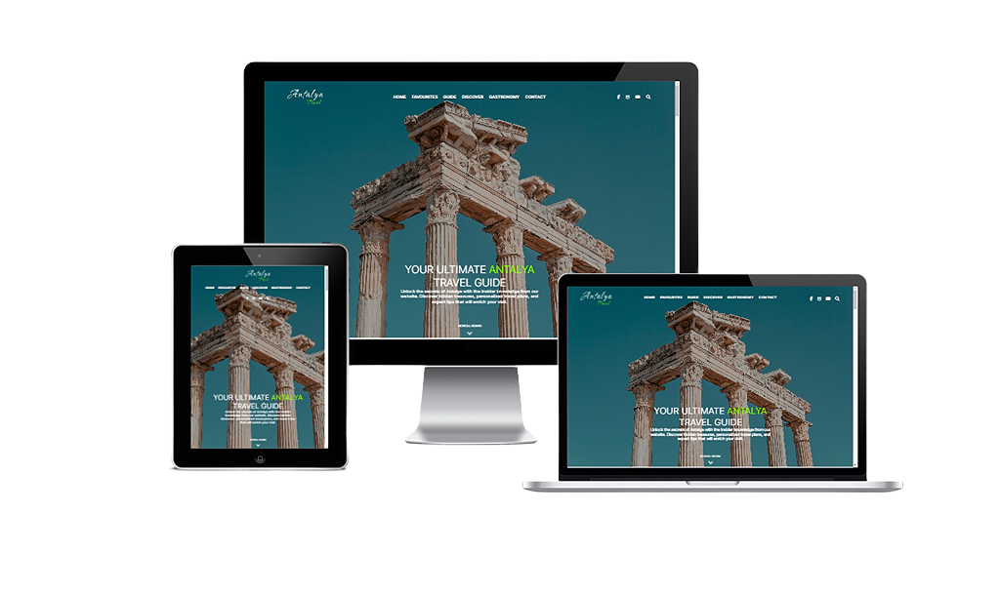

# Antalya Travel

  
[**Screenshots**](#screenshots) || [**Technologies**](#technologies) || [**Color Reference**](#color-reference) || [**Fonts**](#fonts) || [**Photos**](#photos) || [**Lighthouse Report**](#lighthouse-report) || [**Demo**](#demo) || [**Author**](#author)

This repository was created for the final project at Digital Career Institute (DCI). It contains all the code, documentation, and other resources needed for the project.

The project is the result of several days of hard work and showcases the skills I have acquired during my time at DCI. It exclusively uses HTML and CSS and has a responsive design that looks good on all devices.

I hope this project can serve as a resource for other learners, and I welcome feedback and contributions.

## Screenshots

## Technologies
- HTML
- CSS

## Color Reference

| Color             | HEX         |
| ---------------- | --------------- |
| Black         |  #000000 |
| White         |  #ffffff |
| Blue         |  #0000ee |
| Sky Blue      |  #75dee9 |
| Chartreuse         |  #88ff00 |

## Fonts
- Google Fonts
- Local Fonts
- Inter
- Corinthia
- Font Awesome

## Photos
- Pexels

## Lighthouse Report
### Mobile

### Desktop

## Demo
[https://antalya-travel.vercel.app/](https://antalya-travel.vercel.app/)

## Author

- E-mail - [mkambur@proton.me](mkambur@proton.me)
- LinkedIn - [@mkambur](https://linkedin.com/in/mkambur)
